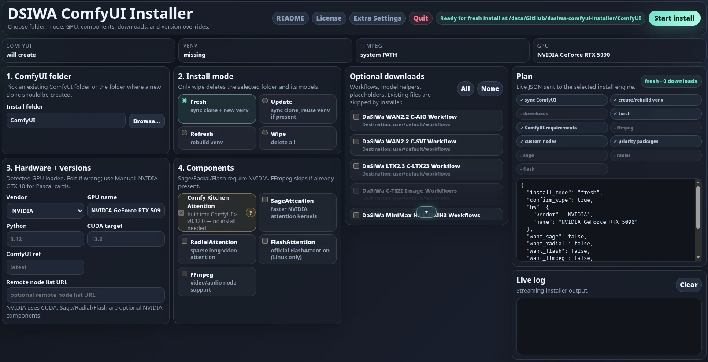

<div align="center">

# DaSiWa ComfyUI Installer

**One binary. Walk away. Come back to a working ComfyUI.**

A standalone installer for [ComfyUI](https://github.com/comfyanonymous/ComfyUI) with a local managed Python runtime and isolated packages. No Python knowledge required. Core installation needs no admin rights; optional Linux FFmpeg installation uses the system package manager.

[](LICENSE)
[](#prerequisites)
[](#hardware-support)
[](#configuration)

</div>



*One-page installer UI. NVIDIA is selected in this preview; AMD ROCm prerequisites and verification limits are listed below.*

---

## Unified One-Page Installer

The installer now presents the full setup on a single local page. Folder
selection, install mode, GPU backend and CUDA target, Sage/Radial/FlashAttention, FFmpeg, optional
downloads, and the final install plan are all visible at once, with no separate
pages or script chain to follow.

That unified layout is deliberate:

- Choose the ComfyUI folder once.
- Pick the install mode once.
- Review hardware and version overrides in the same view.
- Toggle NVIDIA-only Sage/Radial/FlashAttention, FFmpeg, and optional downloads without leaving the page.
- Inspect the live JSON plan before starting the install.
- Use **Extra Settings** for in-memory overrides without mutating the embedded defaults.

---

## What it does

You run the standalone installer binary. It opens a local web UI, asks you a
handful of choices upfront, then runs the native installation flow:

- Downloads a **managed Python runtime** (3.12 by default) into `ComfyUI/.dasiwa/python/`, with packages isolated in `ComfyUI/venv/`
- Clones ComfyUI from its default branch; subsequent syncs use `master` for `latest`, or a chosen ref
- Detects GPU hardware and selects **CUDA, AMD ROCm or Intel XPU** packages; AMD selection and GPU computation are checked explicitly
- Installs the configured **custom nodes** and optionally **SageAttention**, **RadialAttention**, **FlashAttention** and **FFmpeg**
- Creates a ready-to-launch `run_comfyui` starter in your ComfyUI folder
- On subsequent runs, detects what's already installed and asks whether to update, refresh, or leave it alone

---

## Quick Install

The release binaries are the simplest path for most users. Download the file for
your OS, put it in the folder where you want the installer state to live, and run
it directly:

- Linux: `./dasiwa-installer-linux-amd64`
- Windows: `dasiwa-installer-windows-amd64.exe`

```bash
./dasiwa-installer-linux-amd64
```

On Windows, double-click `dasiwa-installer-windows-amd64.exe`.

If you want a direct download from GitHub:

```bash
curl -L -o dasiwa-installer-linux-amd64 \
  https://raw.githubusercontent.com/darksidewalker/dasiwa-comfyui-installer/main/dasiwa-installer-linux-amd64
chmod +x dasiwa-installer-linux-amd64
```

```powershell
$u='https://raw.githubusercontent.com/darksidewalker/dasiwa-comfyui-installer/main/dasiwa-installer-windows-amd64.exe'; $o='dasiwa-installer-windows-amd64.exe'; if (Get-Command curl.exe -ErrorAction SilentlyContinue) { curl.exe -fL --retry 5 --retry-delay 2 -o $o $u } else { Start-BitsTransfer -Source $u -Destination $o }
```

The app opens a local browser page and runs the native Go install engine. The
UI, default config, placeholder assets, README, and license are embedded in the
binary, so users do not need Python scripts, shell scripts, PowerShell scripts,
`config.json`, a node-list text file, or a cloned copy of this repository next
to the executable. Installer tools and caches live in its local `.dasiwa/`
directory. The complete managed Python runtime, including its standard library,
lives separately in `ComfyUI/.dasiwa/python/`; installed packages live in
`ComfyUI/venv/`. After installation, starting ComfyUI does not require the
installer executable or its state directory. Keep the ComfyUI-local runtime:
removing `ComfyUI/.dasiwa/python/` would break its virtual environment.

Before preparing Python, the installer checks GitHub for the latest stable `uv`
release. An existing local or PATH-provided `uv` is reused only if its reported
version matches; otherwise the installer downloads and validates a replacement
under its own `.dasiwa/bin/`. System-installed tools are never updated or replaced.
If the release check or download fails, installation stops with an explicit error
rather than silently using an unverified older version.

**Existing installations:** Choose **Update in place** to migrate a legacy venv
to the ComfyUI-local runtime without clearing its packages. This also repairs a
dangling Python link if the old installer runtime has already been removed.
The existing Python major/minor version is preserved from `pyvenv.cfg`; unreadable
or incompatible environments fail safely rather than being cleared. Refresh and
full reinstall still deliberately rebuild the environment.

To build standalone app binaries, use the build script:

```bash
./build.sh            # version auto-detected via `git describe`
./build.sh 2.2.0     # or pin a specific version
```

This cross-builds the Windows and Linux installer binaries directly into the
repository (app) root. No duplicate binaries are created in `dist/`:

```text
dasiwa-installer-windows-amd64.exe
dasiwa-installer-linux-amd64
```

Equivalently, run the Go release builder directly (`--out` optionally selects
a different single output directory; it does not create a root mirror):

```bash
go run ./cmd/build-release --version 2.2.0
```

Those binaries can be copied into an empty install folder and launched directly.
The embedded `config.json` is the source of defaults. Use **Extra Settings** in
the app to edit JSON overrides for the current install without creating any
extra file.

---

## Prerequisites

| Requirement | Notes |
| :---------- | :---- |
| **GPU** | NVIDIA (GTX 10-series or newer), a listed AMD model/target below, or Intel Arc |
| **Internet / disk** | Active connection; reserve space for the Python/Torch runtime, caches and selected models. Large optional encoders can require many GB each. |
| **Git** | Must already be available in PATH on Windows and Linux; the installer does not install Git. |
| **Drivers** | Install compatible GPU drivers beforehand; the installer does not install or update drivers. AMD requirements are below. |
| **Admin rights** | Not required for the core install. Missing Linux FFmpeg is installed via a system package manager, normally requiring sudo. |

---

## The Web Installer

When you run the binary, it opens a local web page in your browser and collects
the full install plan there before anything is downloaded or changed. You review
the selected folder, hardware, CUDA target, components, and optional downloads
on one page, then start the install once.

**The page includes:**

1. **Install mode** — Fresh, Update, Refresh, or Wipe. Wipe requires the deletion checkbox; **Quit** exits without starting an installation.
2. **Hardware and versions** — GPU vendor, GPU name, Python version, ComfyUI ref, and CUDA target.
3. **Components** — SageAttention, RadialAttention and FlashAttention are opt-in NVIDIA components. AMD/Intel selections disable and uncheck them. Comfy Kitchen Attention is shown as built into compatible ComfyUI versions, not installed as a separate optional extension.
4. **FFmpeg** — yes or no. Skipped automatically if already present.
5. **Optional downloads** — shows only what is not already on disk.
6. **Live plan** — a JSON preview of the exact install request that will be submitted to the native installer engine.

The page collects choices before starting the native Go installer. Core package operations require no interactive choices. If FFmpeg is missing on Linux, install it beforehand or disable its component to avoid a sudo-dependent system installation.

---

## Hardware Support

GPU detection is automatic, but review the vendor and editable GPU-name field before starting. Detection failure leaves a manual NVIDIA placeholder; select the actual vendor/model. AMD rejects unknown names and requires a working GPU computation. NVIDIA/Intel do not currently have the same end-to-end GPU probe.

| Vendor | Series | PyTorch Build |
| :----- | :----- | :------------ |
| **NVIDIA** | RTX 20 / 30 / 40 | Default CUDA 13.0: Torch 2.14.1, torchvision 0.29.1, torchaudio 2.11.0 |
| **NVIDIA** | RTX 50 (Blackwell) | Default CUDA 13.0: Torch 2.14.1, torchvision 0.29.1, torchaudio 2.11.0 |
| **NVIDIA** | GTX 10 / Pascal | CUDA 12.1 + Torch 2.4.1 (locked) |
| **AMD** | RX 6800 / XT, 6900 XT, 6950 XT; PRO W6800 | ROCm 10.0, `gfx1030` |
| **AMD** | RX 7900 XT / XTX; PRO W7800 / W7900 | ROCm 10.0, `gfx1100` |
| **AMD** | RX 7700 XT / 7800 XT | ROCm 10.0, `gfx1101` |
| **AMD** | RX 7600 / XT | ROCm 10.0, `gfx1102` |
| **AMD** | Radeon 8040S / 8050S / 8060S (Strix Halo) | ROCm 10.0, `gfx1151` |
| **AMD** | RX 9060 / XT | ROCm 10.0, `gfx1200` |
| **AMD** | RX 9070 / XT; Radeon AI PRO R9700 | ROCm 10.0, `gfx1201` |
| **Intel** | Arc / iGPU | XPU wheel |

Detection uses `nvidia-smi` and `lspci` on Linux, or Windows CIM/WMI with fallback probes. Selection uses hardware-name heuristics; verify the result on multi-GPU systems. Intel XPU package selection is implemented but is not certified by the AMD verification results.

---

## AMD ROCm installation

The installer has a native AMD path on **Windows and Linux x86_64**. It uses
AMD's stable multi-architecture wheel index, not the old per-family nightly
indexes. The package set is pinned to **Torch 2.13.0, torchvision 0.28.0 and
torchaudio 2.11.0.2**, all with the `+rocm10.0.0` suffix. GPU-specific device
extras install the matching runtime and kernels inside the ComfyUI venv; no
system-wide ROCm/HIP SDK installation is performed.

- **Windows:** Windows 11 **25H2** (build 26200+) and AMD Adrenalin **26.8.1 or
  newer**. The Windows build is checked before installation; the graphics-driver
  version remains a user prerequisite. No driver or Windows security settings
  are changed by the installer.
- **Linux:** A compatible amdgpu driver, supported distribution/runtime and
  permission to access `/dev/kfd` and `/dev/dri`. Drivers and device permissions
  are not modified by the installer. See AMD's release compatibility matrix.
- **Python:** CPython **3.12 or 3.13**. Update preserves the existing venv ABI;
  incompatible existing Python versions fail before migration instead of being
  silently upgraded. Refresh intentionally rebuilds the environment.
- **Selection:** Use an exact listed model or a recognized `gfx` target in the
  GPU-name field. Unknown, conflicting and unlisted mobile GPU names are rejected
  before checkout or wipe; there is no generic AMD-to-RDNA3 fallback.
- **Components:** SageAttention, RadialAttention and FlashAttention options in
  this installer are NVIDIA-only. The UI disables/unchecks them for AMD/Intel,
  and the backend rejects incompatible requests.
- **Verification:** The installer checks the pinned Torch stack and performs a
  synchronized GPU matrix multiplication on the selected architecture, both
  immediately after Torch installation and before reporting completion.
- **Dependencies:** Subsequent uv operations inherit AMD version constraints
  and the stable index. Custom-node failures remain visible as warnings; CUDA-only
  nodes, quantization kernels and FP8 workflows are not guaranteed portable.

Package resolution has been verified for Windows/Linux with Python 3.12/3.13,
including current ComfyUI core requirements. **End-to-end AMD hardware acceptance
is still pending**; available wheels and resolver success are not a hardware test.

References: [AMD ROCm 10.0 compatibility](https://rocm.docs.amd.com/en/docs-10.0.0/compatibility/compatibility-matrix.html),
[AMD multi-architecture packages](https://github.com/ROCm/TheRock/blob/main/RELEASES.md),
[ComfyUI AMD instructions](https://github.com/Comfy-Org/ComfyUI#amd-gpus-windows-rocm-100).

---

## SageAttention

SageAttention delivers significantly faster attention kernels for NVIDIA GPUs. The installer handles the full complexity of getting it working:

**Windows — prebuilt wheel (default)**
Queries [woct0rdho/SageAttention releases](https://github.com/woct0rdho/SageAttention/releases) for a CUDA-tag-matching ABI3 wheel, with bundled fallback URLs for `cu128` and `cu130`. Torch must be at least 2.9; the installer also attempts the matching `triton-windows` family and verifies the SageAttention import.

**Windows — failure behavior**
The current Windows path is wheel-only. No SageAttention source-build fallback is invoked; wheel resolution, installation or import failure stops the install when SageAttention is selected.

**Linux**
Tries the precompiled SageAttention wheel path first. If no compatible wheel exists, the installer attempts a source build only when `nvcc` and a compatible `g++`/`clang++` host compiler are available. Missing or incompatible compilers skip SageAttention instead of failing the whole ComfyUI install.

**CUDA Wheel Selection**
For modern NVIDIA cards, requested CUDA 13.x targets (including the configured default `13.2`) map to `https://download.pytorch.org/whl/cu130` with Torch 2.14.1, torchvision 0.29.1 and torchaudio 2.11.0. TorchAudio 2.11 uses [PyTorch’s stable ABI](https://docs.pytorch.org/audio/stable/installation.html) and officially supports Torch 2.11 and all later versions; its version need not match Torch 2.14.1. GTX 10 / Pascal remains locked to CUDA 12.1, Torch 2.4.1, torchvision 0.19.1 and torchaudio 2.4.1. SageAttention requires newer Torch and is not compatible with that legacy stack.

Torch 2.14 uses Triton 3.8: Linux Sage installs `triton>=3.8,<3.9.dev0`,
Windows uses `triton-windows>=3.8,<3.9` with or without Sage. On Linux without
Sage, Torch supplies its own Triton dependency. Earlier explicitly selected
Torch 2.9–2.12 Windows mappings are unchanged. GTX 10 / Pascal does not receive
a modern priority Triton override; its pinned Torch dependencies remain in charge.

When updating an existing NVIDIA environment to a different Torch/CUDA ABI,
the installer removes old `sageattention` and `flash-attn` distributions before
upgrading Torch. Selected extensions are installed again; unselected ones remain
removed rather than leaving stale compiled kernels behind. Source reinstalls bypass
uv’s old wheel cache so an earlier Torch ABI build cannot be reused. Import checks alone
do not prove GPU-kernel compatibility. Linux CUDA 13 Sage skips the CUDA 12 HF
wheels and requires a compatible source-build toolchain; FlashAttention remains
Linux-only and may be skipped when no matching wheel/toolchain is available.
The final backend check imports Torch, torchvision and torchaudio and verifies
all selected exact package versions plus CUDA, including after backend repair.

Packaging has been checked with real uv Python 3.12 Linux/Windows dry-runs,
including current ComfyUI requirements. This is not a Windows runtime or GPU
attention-kernel test; test the installer on the target GPU before relying on
optional accelerators.

---

## RadialAttention

RadialAttention is a sparse long-video attention optimization. The installer clones the ComfyUI-RadialAttn custom node and its SpargeAttn dependency, then installs them into the venv.

---

## FlashAttention

The installer's FlashAttention path targets Dao-AILab's CUDA attention library on **NVIDIA/Linux**. The Windows path is skipped; AMD implementations are not handled by this component.

**Installation strategies (in order):**

1. **Official release wheel** — checks the [Dao-AILab/flash-attention](https://github.com/Dao-AILab/flash-attention) GitHub releases page for a prebuilt wheel matching your Torch version, CUDA tag, Python tag, and platform.
2. **Community prebuilt wheels** — queries [mjun0812/flash-attention-prebuild-wheels](https://github.com/mjun0812/flash-attention-prebuild-wheels) for a compatible wheel, scoring candidates by platform type (`manylinux` preferred) and version recency.
3. **PyPI binary-only** — attempts `uv pip install --only-binary flash-attn` with the latest PyPI version (fetched from `pypi.org`).
4. **Source build** — clones the flash-attention repo and builds from source. Only attempted when the system has at least 96 GiB of combined RAM + swap, and both `nvcc` and `g++`/`clang++` are available.

**Environment variable overrides:**

| Variable | Default | Effect |
| :------- | :------ | :----- |
| `DASIWA_FLASH_ATTN_VERSION` | latest from PyPI (fallback `2.8.3`) | Pin a specific version |
| `DASIWA_FLASH_ATTN_WHEEL_URL` | unset | Skip all resolution and install a specific wheel URL directly |
| `DASIWA_FLASH_MAX_JOBS` | `2` | Parallel build jobs for source compilation |

**Notes:**
- FlashAttention is non-fatal: installation errors are logged but do not abort the ComfyUI install.
- On Windows, the installer skips FlashAttention entirely with a log message.
- If `flash_attn` is already importable in the venv, installation is skipped.

---

## Custom Nodes

Default nodes are configured in `config.json` under the `custom_nodes` array.
Each entry is a GitHub repo URL with optional pipe flags:

```
# Standard clone
https://github.com/user/node

# Recursive clone for nodes with git submodules (e.g. CosyVoice, Foley)
https://github.com/user/node | sub

# Editable/library install (uv pip install -e .)
https://github.com/user/node | pkg

# Custom requirements filename
https://github.com/user/node | req:requirements-no-cupy.txt

# Flags can be combined
https://github.com/user/node | sub | req:requirements-custom.txt
```

After all nodes are installed, the **Enforcer** runs — a final `uv pip install --upgrade` pass over priority packages to ensure no node has silently downgraded a critical dependency.

### Native dependencies and installation warnings

When a node's requirements declare `llama-cpp-python`, the installer reads the
CUDA version from Torch in the selected ComfyUI venv and uses the corresponding
[official wheel index](https://abetlen.github.io/llama-cpp-python/whl/cu130/llama-cpp-python/).
For CUDA 13.0, version 0.3.35 provides `py3-none-win_amd64` and
`py3-none-manylinux_2_35_x86_64` wheels (the latter requires glibc 2.35 or newer).
`uv` checks Python and platform compatibility and installs llama-cpp's runtime
dependencies separately from the bulk node requirements. Existing llama-cpp
installations are replaced with the selected backend's wheel. There is no
automatic source build or silent CPU fallback when a CUDA wheel cannot be installed.
Without a Torch CUDA backend, the installer uses the CPU wheel index; a missing
compatible version is reported rather than compiled.

Node installation failures do not prevent the remaining nodes and launchers
from being processed. The final UI status is **Install finished with warnings —
incomplete components**, not success. The log identifies the affected node,
package/build error, and recognizable missing prerequisites such as `nmake`,
a C/C++ compiler, a header, or a Python module. Unrecognized failures retain the
original output without guessing which tool is missing. Failures in downloads,
FFmpeg, Manager dependencies, priority packages, and FlashAttention also appear
in the final warning summary.


**To use your own node list:** open **Extra Settings** and replace the
`custom_nodes` array, or paste a remote node-list URL in the GUI:

```json
{
    "custom_nodes": [
        "https://github.com/user/node",
        "https://github.com/user/other-node | req:requirements-no-cupy.txt"
    ]
}
```

---

## Idempotent by Design

Running the installer a second time is safe. It detects existing state before asking any questions:

- **ComfyUI already present?** Defaults to Update; Refresh and Wipe remain explicit choices.
- **Venv already set up?** Reused/migrated in Update mode; rebuilt in Fresh, Refresh or Wipe mode.
- **SageAttention already importable?** Skipped entirely.
- **FFmpeg already in PATH or in `ComfyUI/ffmpeg/`?** Skipped.
- **Models already downloaded?** Menu filtering checks existing filenames. When a download is processed, its size is compared with the remote size if available; this is not a checksum or a full integrity audit of files hidden by the menu.

---

## FFmpeg

FFmpeg is needed by video nodes like VideoHelperSuite, MMAudio, and WhiteRabbit.

- **Windows:** Downloads a portable build (BtbN GPL zip), extracts it to `ComfyUI/ffmpeg/`, and injects the path into the generated launcher script so all child processes inherit it automatically.
- **Linux:** Detects your package manager (`apt-get`, `pacman`, `dnf`, `zypper`, or Homebrew) and installs the system package.
- Both paths skip installation if `ffmpeg` is already reachable in PATH or a local copy already exists.

---

## Architecture: Zero Conflict

The ComfyUI runtime and packages live inside the selected `ComfyUI/` folder.
Installer tools and caches are separate; system Python is not modified.

| What | Where | Notes |
| :--- | :---- | :---- |
| Python runtime + standard library | `ComfyUI/.dasiwa/python/` | Managed by `uv`; required to run ComfyUI |
| Python environment + packages | `ComfyUI/venv/` | Uses the ComfyUI-local runtime |
| ComfyUI itself | `ComfyUI/` | Default-branch clone; existing checkout syncs to `master` or the selected ref |
| Custom nodes | `ComfyUI/custom_nodes/` | Cloned and updated by the installer |
| Portable FFmpeg | `ComfyUI/ffmpeg/bin/` | Windows only; injected into launcher PATH |
| Launcher | `ComfyUI/run_comfyui.bat` / `.sh` | Opens browser + starts server |
| SageAttention | Inside venv | Windows ABI3 wheel; Linux wheel or guarded source build |
| AMD package constraints | `ComfyUI/.dasiwa/rocm-constraints.txt` | Pins the ROCm Torch stack for installer dependency operations |

System Python, persistent system PATH and Windows registry settings are not modified. Child processes receive a local PATH. Optional Linux FFmpeg installation is the exception to local-only package installation.

**Python package management:** Installer package operations use `uv` against the ComfyUI venv, not system Python. Incompatible dependencies can still fail resolution and produce errors or component warnings. Do not use system `pip` to modify this environment.

To manually add a package:

```
# Windows (from the installer root; local uv if downloaded)
.\.dasiwa\bin\uv.exe pip install --python .\ComfyUI\venv\Scripts\python.exe <package-name>

# Linux (from the installer root; local uv if downloaded)
./.dasiwa/bin/uv pip install --python ./ComfyUI/venv/bin/python <package-name>
```

If the installer reused a current PATH-provided `uv`, use `uv` instead of the
local executable path above. Adjust the Python path if your ComfyUI folder is
elsewhere. `uv` is not installed inside the venv. On AMD, manual operations must
also preserve the stable AMD index and the constraints in
`ComfyUI/.dasiwa/rocm-constraints.txt`; the installer's inherited environment is
not automatically active in a separate terminal.

---

## Configuration

The installer is data-driven. Build-time defaults live in the embedded
`config.json`. To override runtime settings without rebuilding, open
**Extra Settings** in the app and edit the JSON there. Supported object sections
are merged over the defaults, while arrays such as `custom_nodes` and
`optional_downloads` replace the default arrays.

```json
{
    "python": { "display_name": "3.13" },
    "comfyui": { "version": "v0.3.9" },
    "cuda": { "global": "13.2" },
    "custom_nodes": [
        "https://github.com/user/node"
    ]
}
```

Only include the keys you want to change. Everything else inherits from `config.json`.

### Runtime configuration reference

The embedded `version` is `2.2.0`. AMD Torch versions and supported gfx targets are selected by the native installer, not by the `cuda` settings. The legacy `urls.msvc_build_tools` entry remains in shipped defaults but is not consumed by the current native flow.

| Key | Default | Purpose |
| :-- | :------ | :------ |
| `python.display_name` | `"3.12"` | Python version passed to `uv python install` |
| `comfyui.version` | `"latest"` | `"latest"` maps to `master` for existing checkouts; another value selects a ref on sync. Initial clone uses the upstream default branch. |
| `comfyui.fallback_branch` | `"master"` | Used if the targeted tag checkout fails |
| `cuda.global` | `"13.2"` | Requested NVIDIA wheel target; CUDA 13.x maps to the pinned CUDA 13.0 package set |
| `cuda.min_cuda_for_50xx` | `"13.2"` | RTX 50-series wheel target; takes precedence over the generic target and maps to CUDA 13.0 |
| `custom_nodes` | array | Default custom node repos and optional pipe flags |
| `urls.custom_nodes` | unset | Optional remote node-list URL; when set, it overrides `custom_nodes` |
| `urls.ffmpeg_windows` | BtbN release URL | Portable FFmpeg zip for Windows |
| `urls.sage_repo` | thu-ml/SageAttention | SageAttention source for the fallback build |
| `urls.sparge_repo` | woct0rdho/SpargeAttn | SpargeAttention source for RadialAttention |
| `urls.radial_node_repo` | woct0rdho/ComfyUI-RadialAttn | RadialAttention custom node repo |
| `urls.flash_attn_repo` | Dao-AILab/flash-attention | FlashAttention source for the fallback build |
| `optional_downloads` | — | Models and workflows offered in the web installer |

### Adding models and workflows

To customize optional downloads for the current run, replace the `optional_downloads` array in **Extra Settings**. To change shipped defaults, edit `config.json` before rebuilding. A direct-download entry has this shape:

```json
{
    "name": "My Model",
    "type": "models/checkpoints",
    "url": "https://huggingface.co/.../my-model.safetensors"
}
```

For GitHub-hosted workflow JSON files, set `version` to `"latest"` and provide `repo_path` and `folder` instead of `url`. The installer lists folder contents and selects the highest trailing `-<number>.json` revision, with filename ordering as a tie-breaker/fallback. If the GitHub contents API fails, it attempts a Git-based lookup; selection is not based on commit timestamps.

---

## Run Modes

The web installer exposes these modes; **Quit** closes the app without starting an installation:

| Mode | What happens |
| :--- | :----------- |
| **Fresh** | Clones/syncs ComfyUI and creates a new venv; on an existing folder, rebuilds its venv without deleting models |
| **Update** | Syncs ComfyUI and nodes; reuses/migrates an existing venv while preserving its Python ABI |
| **Refresh** | Rebuilds the venv, reinstalls packages, keeps models |
| **Wipe** | Deletes the selected ComfyUI folder, including models, then starts over; requires the deletion checkbox and Start install |
| **Quit** | Exits without starting installation; not an install mode |

---

## Tuning SageAttention Builds

For power users who need to tune source build performance, three environment variables override the defaults before running the installer:

| Variable | Default | Effect |
| :------- | :------ | :----- |
| `DASIWA_SAGE_MAX_JOBS` | `2` | Source-build jobs (Linux fallback) |
| `DASIWA_SAGE_EXT_PARALLEL` | `2` | Parallel CUDA extension builds |
| `DASIWA_SAGE_NVCC_THREADS` | `--threads 4` | NVCC thread count |

These settings apply to the Linux source-build fallback. Keep parallelism conservative: CUDA extension compilation can consume substantial RAM, and increasing job counts can cause out-of-memory failures.

---

## Disclaimer

Provided as a community tool, as-is, without warranty. AI generation is resource-intensive — ensure adequate cooling. See [LICENSE](LICENSE) for full terms (MIT).
